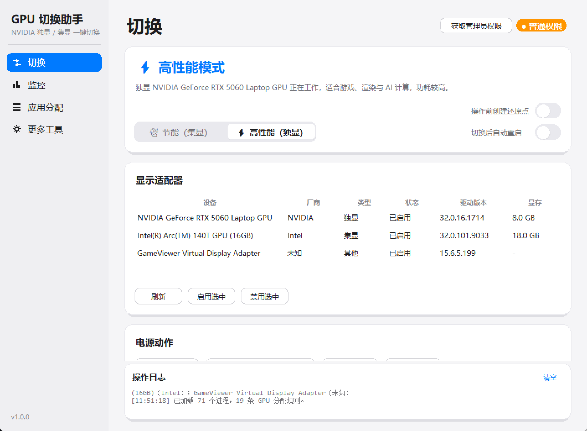
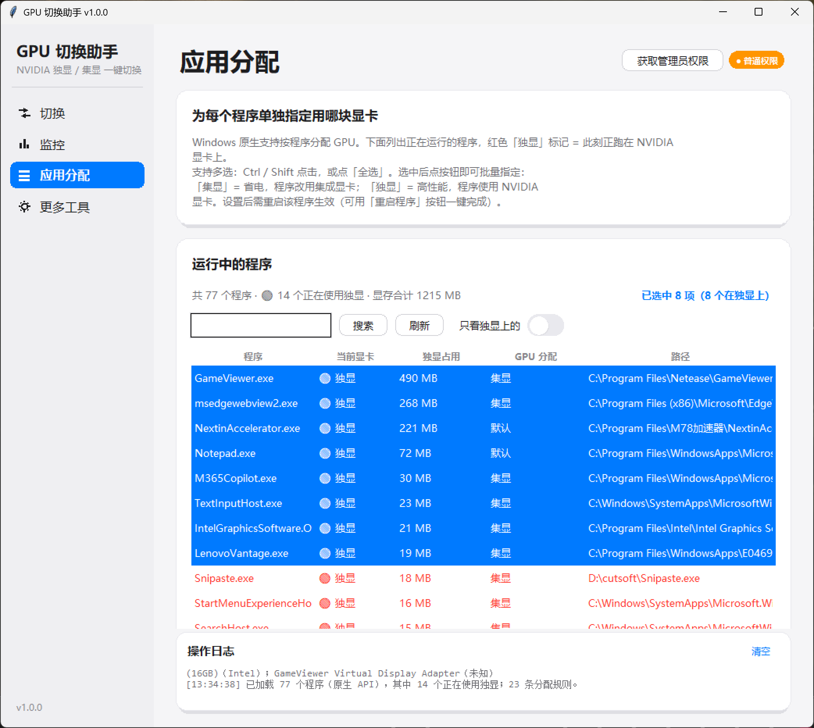
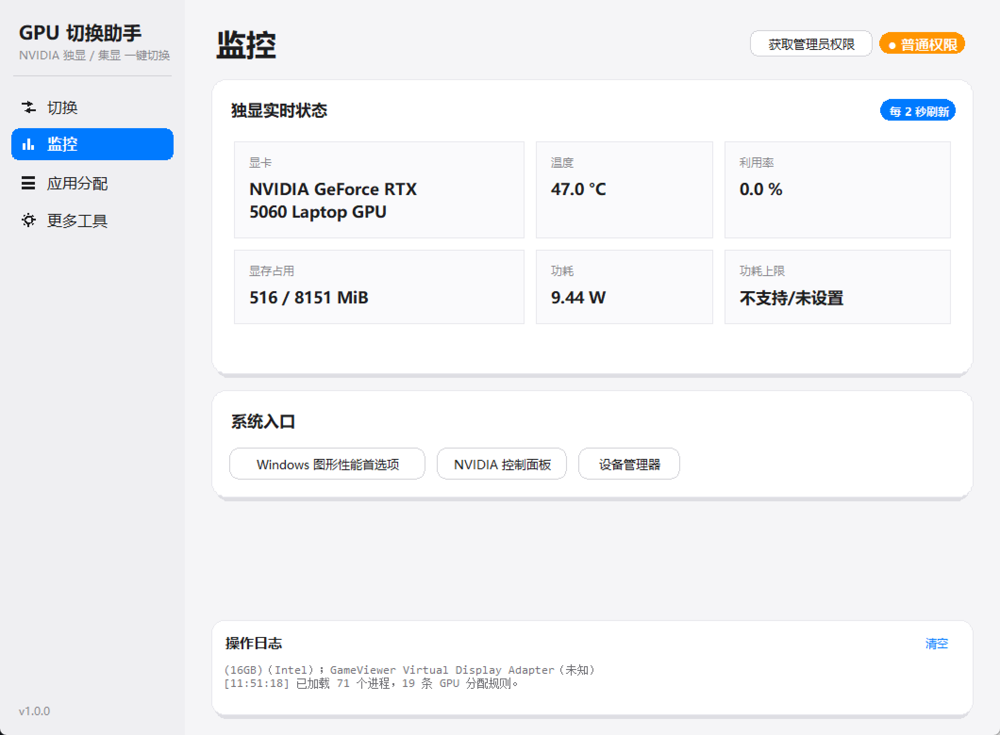
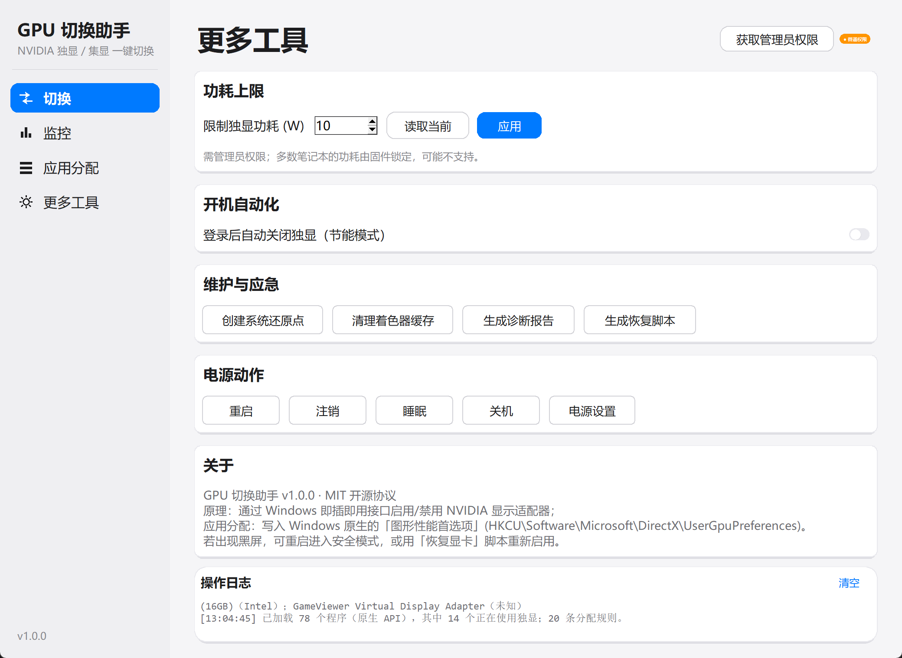

# GPU Switcher (GpuSwitcher)

[简体中文](README.md) | [English](README_EN.md)

**Actually turn the discrete GPU *off* — not just route apps to it.**

To save power on a laptop, Windows' built-in "Graphics performance preferences" only lets
you pick apps one at a time, and each change needs that app **restarted individually** to take
effect. And to genuinely cut power, the only way is to disable the dGPU in Device Manager —
a multi-step job that can easily lock you into a black screen.

GpuSwitcher folds both jobs into a single exe:

| Pain point | How it helps |
| --- | --- |
| No idea which apps are using the dGPU | Live list of every process with its GPU, 🔴 marks the ones on the dGPU, with VRAM and utilization |
| Too many apps to change one by one | **Multi-select batch** assign, then **restart them** so the new assignment takes effect immediately |
| Want real power savings | Switch the whole machine to integrated graphics — **disables the dGPU device outright**; heat and fan noise drop right away |
| Several of the selected apps are on the dGPU | "**Select all using dGPU**" + "⚡ Free the dGPU in one click" |
| Afraid of bricking the display | Creates a **restore point** before every operation and generates a **recovery script** — double-click it to get back |

- Single-file exe, no installation, double-click to run
- License: **MIT**
- Uses only built-in Windows APIs plus `nvidia-smi`; no network required
- Fully supports high DPI (150% / 200% scaling)

| Switch | App assignment |
| --- | --- |
|  |  |

| Monitor | More tools |
| --- | --- |
|  |  |

---

## Related tools

| Project | What it does |
| --- | --- |
| [Auto Clicker](https://github.com/xavier111222/AutoClicker) | Clicking + macro scripting + background cross-app clicking |
| [Screen Recorder](https://github.com/xavier111222/ScreenRecorder) | Four capture modes: full screen / picked region / app window / auto-detected |

All three share the same high-DPI UI skeleton (`ui_kit.py`), so they look and behave consistently.

---

## Download

👉 **[Download from the Releases page](https://github.com/xavier111222/GpuSwitcher/releases/latest)**
→ asset `GpuSwitcher-v1.1.0.exe` (single file, ~11 MB, double-click to run)

The same page ships `SHA256SUMS.txt`. Verify with:

```bat
certutil -hashfile GpuSwitcher-v1.1.0.exe SHA256
```

> GitHub Release asset names don't support non-ASCII characters, so the published
> file uses an English name. Copied to your desktop it becomes `GPU切换助手.exe`
> (the built-in name in the source).

## Quick start

1. Double-click **`GPU切换助手.exe`**
2. On first run, click **"Get administrator rights"** top-right (switching GPUs requires admin)
3. Click **"🍃 Power saving (integrated)"** → the dGPU is disabled, the integrated GPU takes
   over, and power draw / heat / fan noise drop immediately
4. For gaming / rendering / AI workloads, click **"⚡ High performance (discrete)"** to switch back

> We recommend **signing out or restarting once** after a switch, so the dGPU is fully
> released from processes holding it.

---

## Features

### 🍃 Whole-machine switching ("Switch" tab)

| Feature | Description |
| --- | --- |
| Power saving mode | Disable all NVIDIA display adapters, fall back to integrated graphics |
| High performance mode | Re-enable the discrete GPU |
| Enable/disable individual device | Right-click a GPU in the list to operate on it alone |
| Restart / sign out / sleep / shut down | Signing out is the "gentle" way to release the dGPU |
| Restore point before each action | iOS-style toggle, one click to enable |

### 🎯 Per-app GPU assignment ("App assignment" tab)

**This is Windows' "Graphics performance preferences", moved into a tool:**

- Lists every **running process** (enumerated via native APIs, milliseconds)
- **Instantly see who is eating the dGPU**: the new "Current GPU" column marks processes on the
  discrete GPU as 🔴 discrete, highlights the whole row red, and shows VRAM usage and
  utilization (same data source as Task Manager, via the Windows GPU Engine performance
  counters); the list is sorted by dGPU usage, largest first
- Summary bar up top: **N programs total · 🔴 M currently on the dGPU · X MB VRAM combined**
- "Only show dGPU" toggle: filter out everything not using the discrete GPU
- **Multi-select batch operations**: Ctrl / Shift to select, `Ctrl+A` for all, or
  **"Select all using dGPU"** to grab every process currently on the discrete GPU in one click

| Batch button | What it does |
| --- | --- |
| 🍃 Batch → integrated (save power) | Write every selected program to "power saving (integrated)" at once, then offer to restart them so it takes effect |
| ⚡ Batch → discrete | Write every selected program to "high performance (discrete)" |
| Reset to default | Clear the rule for selected programs, handing the decision back to Windows |
| 🔄 Restart programs (apply) | Kill and reopen the selected programs — **this is the action that actually makes the new assignment take effect** |
| ⚡ Free the dGPU in one click | Set **every** process currently on the dGPU to integrated and restart them at once; the dGPU is immediately free |
| End process | Batch `taskkill` on the selection |

- Supports **search** (instant filter, no rescan), **manual program add** (pick an exe),
  **rule deletion**, and **viewing saved rules**
- Critical system processes (`explorer.exe` / `dwm.exe` / `svchost.exe` …) are **skipped
  automatically**, so you can't accidentally restart Explorer and wreck your desktop

How it works: writes to the native Windows registry key
`HKCU\Software\Microsoft\DirectX\UserGpuPreferences`
(`GpuPreference=1;` integrated / `GpuPreference=2;` discrete), which is exactly equivalent
to the system settings page. **The program must be restarted for this to take effect.**

### 📊 Everything else

| Feature | Description |
| --- | --- |
| Live monitoring | Temperature, utilization, VRAM, power draw; refreshes every 2 seconds |
| Power limit | Calls `nvidia-smi -pl` to cap TGP (not supported on all laptops) |
| Auto power-saving on boot | Scheduled task that disables the dGPU at logon |
| System restore point | One click before an operation, so you can roll back |
| Recovery script | Generates `恢复显卡（双击运行）.bat` — double-click to recover from a black screen |
| Clear shader cache | NVIDIA DXCache / D3DSCache / GLCache |
| Generate diagnostic report | GPU + `nvidia-smi -q` + GPU rules + system info |

---

## Command line

```bat
GPU切换助手.exe --list                  :: list all display adapters
GPU切换助手.exe --json                  :: JSON output
GPU切换助手.exe --apps                  :: list running programs and dGPU usage
GPU切换助手.exe --dpiinfo               :: DPI awareness status (diagnostic)
GPU切换助手.exe --apply power           :: switch to power-saving mode (needs admin)
GPU切换助手.exe --apply performance     :: switch to high-performance mode
GPU切换助手.exe --apply power --restart :: switch, then restart after 5 seconds
```

Exit codes: `0` success / `1` partial failure / `2` insufficient privileges /
`3` no NVIDIA discrete GPU detected.

---

## How does it work?

No driver-level hacks — only official Windows interfaces:

1. **Device enumeration**: reads the registry
   `HKLM\SYSTEM\CurrentControlSet\Enum` directly, filtering devices whose `Driver` points at
   the display class `{4d36e968-e325-11ce-bfc1-08002be10318}` — about **3000× faster** than
   PowerShell's `Get-PnpDevice` (5 ms vs 15 s)
2. **Enable/disable**: `pnputil /enable-device` `/disable-device` (native and fast), falling
   back to PowerShell's `Enable-PnpDevice` / `Disable-PnpDevice` on failure
3. **Per-app GPU assignment**: writes the `UserGpuPreferences` registry key
4. **Per-process GPU detection**: DXGI adapter LUID enumeration + reading the Windows "GPU
   Engine" performance counters (the same data source Task Manager uses, via the native PDH
   API, in milliseconds), attributing each instance to a process by the pid / luid in its
   name, then mapping to a GPU; `nvidia-smi --query-compute-apps` supplements this
5. **Monitoring**: `nvidia-smi`

---

## ⚠ Notes

1. **Administrator rights are required** to enable/disable devices; the app walks you
   through elevating.
2. **Discrete-GPU-direct (MUX) laptops**: disabling the dGPU may cause a black screen. The app
   warns when it can't detect integrated graphics. If something goes wrong, boot into Safe
   Mode or double-click the generated `恢复显卡（双击运行）.bat`.
3. While the dGPU is disabled `nvidia-smi` is unavailable, so the monitor panel showing
   "discrete GPU unavailable" is expected.
4. Vendor utilities from Lenovo / ASUS / Dell may re-enable the dGPU automatically.
5. If SmartScreen blocks the first run, click "More info → Run anyway" (common for
   unsigned open-source builds).
6. Full high-DPI support (150% / 200% scaling): the app declares Per-Monitor V2 awareness,
   and all fonts and layouts scale with the real DPI — crisp, not blurry, on high-res screens.

---

## Build from source

```bat
python -m venv .venv
.venv\Scripts\pip install -r requirements.txt
.venv\Scripts\python build.py     :: generate icon → PyInstaller → copy to desktop
```

Run from source directly (needs a Python with tkinter):

```bat
python gpu_switcher.py
python gpu_switcher.py --list
```

### Project layout

```
GpuSwitcher/
├── gpu_switcher.py     # all application code (single file: GUI + CLI + backend)
├── make_icon.py        # generates assets/icon.ico
├── build.py            # one-click build and copy to desktop
├── assets/icon.ico
├── docs/               # README screenshots
├── requirements.txt    # build-time dependencies only
├── LICENSE             # MIT
└── README.md
```

---

## FAQ

**Q: Nothing happens when I click power-saving mode / it reports failure?**
A: Insufficient privileges (the title bar should show "● Administrator"), or processes are
holding the dGPU. Go to the "App assignment" tab and end the occupying processes, or tick
"auto-restart after switching".

**Q: How do I make one app use integrated graphics and others use the discrete GPU?**
A: That's exactly what the "App assignment" tab is for — don't disable the dGPU, just assign
"power saving (integrated)" to the specific apps.

**Q: Is a brief flash when switching normal?**
A: Yes. Windows rebuilds the display topology, so it flickers for 1–2 seconds.

**Q: Setting the power limit fails?**
A: On most laptops GPU power is locked by the EC/firmware, so `nvidia-smi` has no permission
to change it. This is a hardware limitation, not a bug.

---

## License

MIT — see [LICENSE](LICENSE). Use at your own risk; the author is not responsible for
hardware damage or data loss.
